<!-- README.md is generated from README.Rmd. Please edit that file -->
rmaverick
=========

[](https://travis-ci.org/bobverity/rmaverick) [](https://codecov.io/github/bobverity/rmaverick?branch=develop) [](https://ci.appveyor.com/project/bobverity/rmaverick)

The goal of *rmaverick* is to infer population structure from genetic data. What makes *rmaverick* different from other similar programs is its ability to estimate the *evidence* for different numbers of sub-populations (K), and even different evolutionary models, through a method called generalised thermodynamic integration (GTI). *rmaverick* is an updated version of the earlier program [MavericK](https://www.ncbi.nlm.nih.gov/pmc/articles/PMC4981280/), and comes with a number of new features that make it more powerful and easier to use.

*It is worth stating at the outset that rmaverick is designed for relatively small data sets of hundreds of samples and tens to hundreds of loci. It is not designed for large-scale genomic data sets (e.g. thousands of SNPs), for which other programs are more appropriate.*

Installation
------------

*rmaverick* relies on the [Rcpp](https://cran.r-project.org/web/packages/Rcpp/index.html) package, which requires the following OS-specific steps:

-   Windows
    -   Download and install the appropriate version of [Rtools](https://cran.rstudio.com/bin/windows/Rtools/) for your version of R. On installation, ensure you check the box to arrange your system PATH as recommended by Rtools
-   Mac OS X
    -   Download and install [XCode](http://itunes.apple.com/us/app/xcode/id497799835?mt=12)
    -   Within XCode go to Preferences : Downloads and install the Command Line Tools
-   Linux (Debian/Ubuntu)
    -   Install the core software development utilities required for R package development as well as LaTeX by executing

            sudo apt-get install r-base-dev texlive-full

Next, in R, ensure that you have the [devtools](https://www.rstudio.com/products/rpackages/devtools/) package installed by running

``` r
install.packages("devtools", repos='http://cran.us.r-project.org')
```

Then install the *rmaverick* package directly from GitHub by running

``` r
devtools::install_github("bobverity/rmaverick")
```

Finally, we need to load the package:

``` r
library(rmaverick)
```

Example analysis
----------------

This example demonstrates the complete analysis pipeline, including importing data, running the main MCMC, diagnosing good and bad MCMC behaviour, comparing different models, and producing basic outputs.

### Simulate some data

*rmverick* comes with built-in functions for simulating data from different evolutionary models. The models used in simulation are exactly the same as the models used in the inference step, allowing us to test the power of the program without worrying about discrepancies between the data and the assumed model. We will simulate a data set of 100 diploid individuals from the no-admixture model, each genotyped at 20 loci and originating from 3 distinct subpopulations. We will assume no admixture between populations:

``` r
mysim <- sim_data(n = 100, loci = 20, K = 3, admix_on = FALSE)
```

Running `names(mysim)` we can see that the simulated data contains several elements:

``` r
names(mysim)
#> [1] "data"         "allele_freqs" "admix_freqs"  "group"
```

As well as the raw data, we have a record of the allele frequencies, admixture frequencies and grouping that were used in generating these data. These can be useful in ground-truthing our estimated values later on, but are not actually used by the program. All that is needed for *rmaverick* analysis is the "data" element.

Running `head(mysim$data)` we can see the general data format required by *rmaverick*:

``` r
head(mysim$data)
#>     ID pop ploidy locus1 locus2 locus3 locus4 locus5 locus6 locus7 locus8
#> 1 ind1   1      2      2      1      5      5      3      3      4      3
#> 2 ind1   1      2      5      2      5      2      2      1      5      3
#> 3 ind2   1      2      2      3      4      5      3      3      4      4
#> 4 ind2   1      2      4      2      1      2      4      1      2      3
#> 5 ind3   1      2      2      1      1      1      2      4      4      5
#> 6 ind3   1      2      3      3      5      2      1      4      2      4
#>   locus9 locus10 locus11 locus12 locus13 locus14 locus15 locus16 locus17
#> 1      5       1       3       5       2       1       5       3       2
#> 2      5       1       5       1       3       1       4       3       2
#> 3      5       1       3       1       3       3       4       3       2
#> 4      3       1       3       5       1       2       4       3       1
#> 5      3       1       5       4       3       5       4       2       4
#> 6      2       1       2       1       5       5       4       3       3
#>   locus18 locus19 locus20
#> 1       4       1       2
#> 2       4       1       2
#> 3       1       1       2
#> 4       1       1       2
#> 5       1       3       2
#> 6       4       1       2
```

Samples are in rows and loci are in columns, meaning for polyploid individuals multiple rows must be used for the same individual (here two rows per individual). There are also several meta-data columns, including the sample ID, the population of origin of the sample, and the ploidy. These meta-data columns are optional and can be turned on or off when loading the data into a project.

### Create a project and read in data

*rmaverick* works with projects, which are essentially just simple lists containing all the inputs and outputs of a given analysis. We start by creating a project and loading in our data:

``` r
myproj <- mavproject()
myproj <- bind_data(myproj, mysim$data, ID_col = 1, pop_col = 2, ploidy_col = 3)
```

Notice the general format of the `bind_data()` function, which takes the same project as both input and output. This is the format that most *rmaverick* functions will take, as it allows a function to modify the project before overwriting the original version. Notice also that we have specified which columns are meta-data, and all other columns are assumed to contain genetic data. We can view the project to check that the data have been loaded in correctly:

``` r
myproj
#> DATA:
#>    individuals = 100
#>    loci = 20
#>    ploidy = 2
#>    pops = 3
#>    missing data = 0 of 4000 gene copies (0%)
#> 
#> PARAMETER SETS:
#>    (none defined)
```

If there have been mistakes in reading in the data, for example if mata-data columns have not been specified and so have been interpreted as genetic data (a common mistake) then this should be visible at this stage.

### Define parameters and run basic MCMC

We can define different evolutionary models by using different parameter sets. Our first parameter set will represent a simple no-admixture model - the same model that was used to generate the data.

``` r
myproj <- new_set(myproj, name = "correct model (no admixture)", admix_on = FALSE)
```

Producing a summary of the project we can now see additional properties, including the current active set and the parameters of this set.

``` r
myproj
#> DATA:
#>    individuals = 100
#>    loci = 20
#>    ploidy = 2
#>    pops = 3
#>    missing data = 0 of 4000 gene copies (0%)
#> 
#> PARAMETER SETS:
#>  * SET1: correct model (no admixture)
#> 
#> ACTIVE SET: SET1
#>    model = no-admixture
#>    lambda = 1
```

Now we are ready to run a basic MCMC. We will start by exploring values of K from 1 to 5, using 1000 burn-in iterations and 1000 sampling iterations. By default the MCMC has `auto_converge` turned on, meaning it will test for convergence every `convergence_test` iterations and will exit if convergence is reached (`convergence_test = burnin/10` by default). Hence, it is generally a good idea to set `burnin` to be higher than expected, as the MCMC will adjust this number down if needed. The number of sampling iterations can also be tuned. Our aim when choosing the number of sampling iterations should be to obtain enough samples that our posterior estimates are accurate to an acceptable tolerance level, but not so many that we waste time running the MCMC for long periods past this point. We will look into this parameter again once the MCMC has completed. The most unfamiliar parameter for most users will be the number of "rungs". *rmaverick* runs multiple MCMC chains simultaneously, each at a different rung on a "temperature ladder". The cold chain is our ordinary MCMC chain, and the hot chains serve two purposes: 1) they improve MCMC mixing, 2) they are central to the GTI method of estimating the evidence for different models. Finally, for the sake of this document we will run with `pb_markdown=TRUE` to avoid printing large amounts of output, but ordinarily this argument should be omitted.

``` r
myproj <- run_mcmc(myproj, K = 1:5, burnin = 1e3, samples = 1e3, rungs = 10, pb_markdown =  TRUE)
#> Calculating exact solution for K = 1
#>    completed in 0.00213408 seconds
#> 
#> Running MCMC for K = 2
#> Burn-in phase
#> 
  |                                                                       
  |=================================================================| 100%
#>    converged within 200 iterations
#> Sampling phase
#> 
  |                                                                       
  |=================================================================| 100%
#>    completed in 0.833058 seconds
#> 
#> Running MCMC for K = 3
#> Burn-in phase
#> 
  |                                                                       
  |=================================================================| 100%
#>    converged within 100 iterations
#> Sampling phase
#> 
  |                                                                       
  |=================================================================| 100%
#>    completed in 1.03707 seconds
#> 
#> Running MCMC for K = 4
#> Burn-in phase
#> 
  |                                                                       
  |=================================================================| 100%
#>    converged within 600 iterations
#> Sampling phase
#> 
  |                                                                       
  |=================================================================| 100%
#>    completed in 1.45947 seconds
#> 
#> Running MCMC for K = 5
#> Burn-in phase
#> 
  |                                                                       
  |=================================================================| 100%
#>    converged within 300 iterations
#> Sampling phase
#> 
  |                                                                       
  |=================================================================| 100%
#>    completed in 1.6302 seconds
#> 
#> Processing results
```

Notice that the solution for K=1 is almost instantaneous, as no MCMC is required in this case. All other values of K converged within the specified burn-in period. If this was not the case, for example if one value of K had failed to converge, then we could use the same `run_mcmc()` function to re-run the MCMC for just this value of K with a longer maximum burn-in. This will overwrite the existing output for the problem value of K, but will leave all other values untouched:

``` r
myproj <- run_mcmc(myproj, K = 2, burnin = 1e4, converge_test = 100, samples = 1e3, rungs = 10, pb_markdown =  TRUE)
#> Running MCMC for K = 2
#> Burn-in phase
#> 
  |                                                                       
  |=================================================================| 100%
#>    converged within 100 iterations
#> Sampling phase
#> 
  |                                                                       
  |=================================================================| 100%
#>    completed in 0.823842 seconds
#> 
#> Processing results
```

### Comparing values of K

The GTI method estimates the evidence for a given model by combining information across multiple temperature rungs. These rungs provide a series of point estimates that together make a "path", and the final evidence estimate is computed from the area between this path and the zero-line. We can visualise this path using the `plot_GTI_path()` function:

``` r
plot_GTI_path(myproj, K = 3)
```

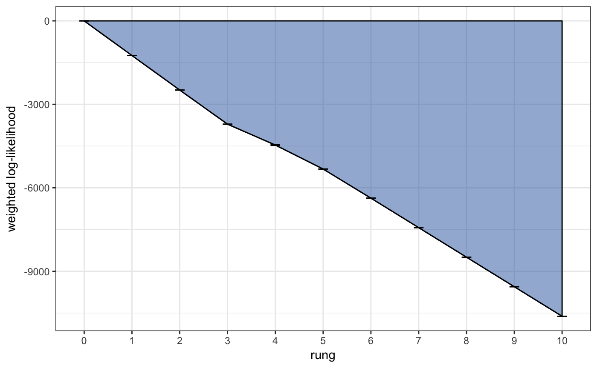

All plots produced by *rmaverick* are produced using [ggplot](https://ggplot2.tidyverse.org/), meaning they can be stored and modified later on - for example adding titles, legends etc.

In order for our evidence estimate to be unbiased, it is important that the GTI path is relatively smooth. We can modify the smoothness of the path in two ways: 1) by increasing the number of `rungs` used in the MCMC, 2) by changing the value of `GTI_pow` which controls the curvature of the path (higher values lead to more steep curvature). Ideally we want a straight path, i.e. we want as little curvature as possible. In the example above we have a good number of rungs and a nice straight path, so there is no need to re-run the MCMC. **This check should be performed on every value of K**.

Once we are happy with our GTI paths we can look at our evidence estimates, first of all in log space:

``` r
plot_logevidence_K(myproj)
```

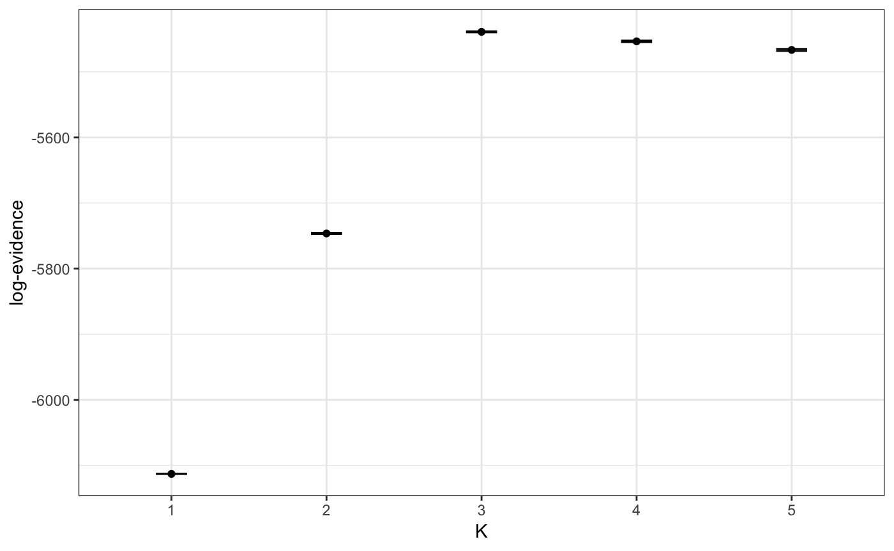

We can see a clear signal for K=3 or higher, and the 95% credible intervals are nice and tight. If we needed tighter credible intervals at this stage then we could re-run the MCMC (for the problem values of K only) with a larger number of `samples`.

We can also plot the full posterior distribution of K, which is obtained by transforming these values out of log space and normalising to sum to one:

``` r
plot_posterior_K(myproj)
```

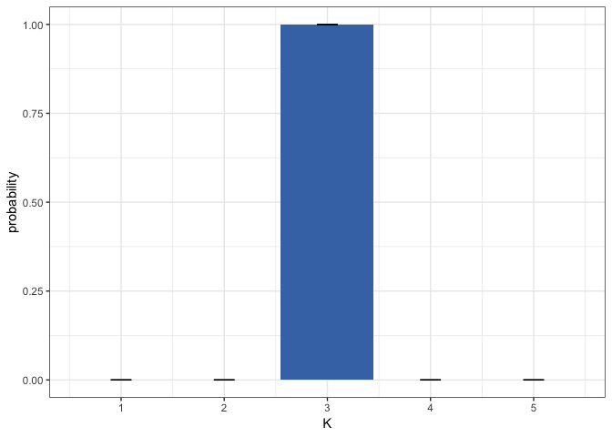

This second plot is usually more straightfoward to interpret, as it is in linear space and so can be understood in terms of ordinary probability. In this example we can see strong evidence for K=3, with a posterior probability of &gt;0.99. Again, if we had seen wide credible intervals at this stage then it would have be worth repeating the MCMC with a larger number of `samples`, but in this case the result is clear and so there is no need.

### Structure plots

The main result of interest from this sort of analysis is usually the posterior allocation or "structure" plot. This plot contains one bar for each individual, with the proportion of each colour giving the posterior probability of belonging to each of the K subpopulations. We can use the `plot_qmatrix()` function to produce posterior allocation plots for different values of K:

``` r
plot_qmatrix(myproj, K = 2:5, divide_ind_on = TRUE)
```

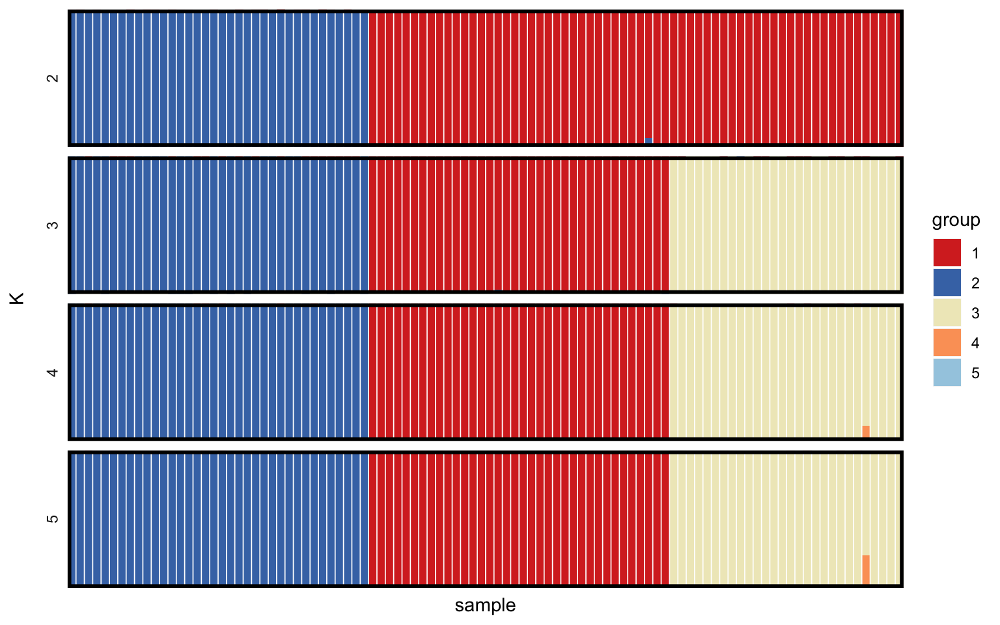

We can see that for K=3 (the most highly supported value of K) there is a clear split into three distinct subpopulations. The advantage of simulated data is that we can verify that this is the correct grouping by looking at `mysim$group`. When reporting and publishing results it is a good idea to produce posterior allocation plots for a range of values of K so that the reader has the option of visualising structure at multiple levels, but ideally this should also be backed up by a plot of the model evidence to give some idea of the model fit at each level. At this stage it is worth stressing the point made by many previous authors - **the model used by rmaverick and similar programs is just a cartoon of reality, and that there is no strict K in the real world**. Instead, each K captures a different level of population structure, and while the evidence can help guide us towards values of K that fit the data well, it is just a guide and should be taken alongside other biological considerations.

### Admixture model

We will also run the simulated data through the admixture model, partly to explore how this model differs in implementation from the simpler no-admixture model, and partly to test whether *rmaverick* can detect that this model is incorrect based on the model evidence.

We start by creating a new parameter set, this time under the admixture model and with the parameter alpha free to be estimated by the MCMC. Alpha controls the level of admixture, with larger values indicating a greater probability of inheriting genes from multiple populations, and arriving back at the no-admixture model when alpha equals zero.

``` r
myproj <- new_set(myproj, name = "incorrect model (admixture)", admix_on = TRUE, estimate_alpha = TRUE)
myproj
#> DATA:
#>    individuals = 100
#>    loci = 20
#>    ploidy = 2
#>    pops = 3
#>    missing data = 0 of 4000 gene copies (0%)
#> 
#> PARAMETER SETS:
#>    SET1: correct model (no admixture)
#>  * SET2: incorrect model (admixture)
#> 
#> ACTIVE SET: SET2
#>    model = admixture
#>    estimate alpha = TRUE
#>    lambda = 1
```

The admixture model tends to take considerably longer to run than the no-admixture model, and mixes more poorly. This is because the MCMC now has to consider the population assignment of each gene copy seperately, and also has additional parameters to estimate. For this reason we suggest that **if there is no prior biological reason to expect admixture between populations then consider running the simpler non-admixture model only**.

We run the MCMC the same way as before, this time anticipating that we might need a greater number of burn-in and sampling iterations. Again, this should be run without the `pb_markdown=TRUE` argument ordinarily):

``` r
myproj <- run_mcmc(myproj, K = 1:5, burnin = 1e4, converge_test = 100, samples = 2e3, rungs = 10, pb_markdown = TRUE)
#> Calculating exact solution for K = 1
#>    completed in 0.0802589 seconds
#> 
#> Running MCMC for K = 2
#> Burn-in phase
#> 
  |                                                                       
  |=================================================================| 100%
#>    converged within 100 iterations
#> Sampling phase
#> 
  |                                                                       
  |=================================================================| 100%
#>    completed in 27.9552 seconds
#> 
#> Running MCMC for K = 3
#> Burn-in phase
#> 
  |                                                                       
  |=================================================================| 100%
#>    converged within 100 iterations
#> Sampling phase
#> 
  |                                                                       
  |=================================================================| 100%
#>    completed in 31.9599 seconds
#> 
#> Running MCMC for K = 4
#> Burn-in phase
#> 
  |                                                                       
  |=================================================================| 100%
#>    converged within 800 iterations
#> Sampling phase
#> 
  |                                                                       
  |=================================================================| 100%
#>    completed in 38.1948 seconds
#> 
#> Running MCMC for K = 5
#> Burn-in phase
#> 
  |                                                                       
  |=================================================================| 100%
#>    converged within 300 iterations
#> Sampling phase
#> 
  |                                                                       
  |=================================================================| 100%
#>    completed in 38.8032 seconds
#> 
#> Processing results
```

As before, we need to check the behaviour of our MCMC. Under the admixture model we have the additional parameter alpha to check. We can produce a summary plot of this parameter as follows:

``` r
plot_alpha(myproj, K = 3)
```

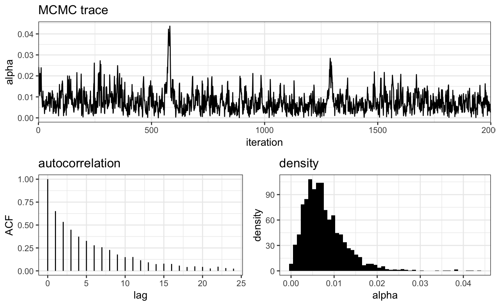

The MCMC trace shows the actual value of alpha at each iteration of the MCMC, the autocorrelation plot shows how far apart draws need to be before they are approximately independent (here ~20), and the density plot gives the posterior distribution of alpha. Notice that the estimated value of alpha is very small (~0.01). This is an early indication that the no-admixture model may be more appropriate here, as the adxmiture model is essentially converging on this simpler model.

As before, we need to check that our GTI path is smooth and straight **for all values of K**:

``` r
plot_GTI_path(myproj, K = 3)
```

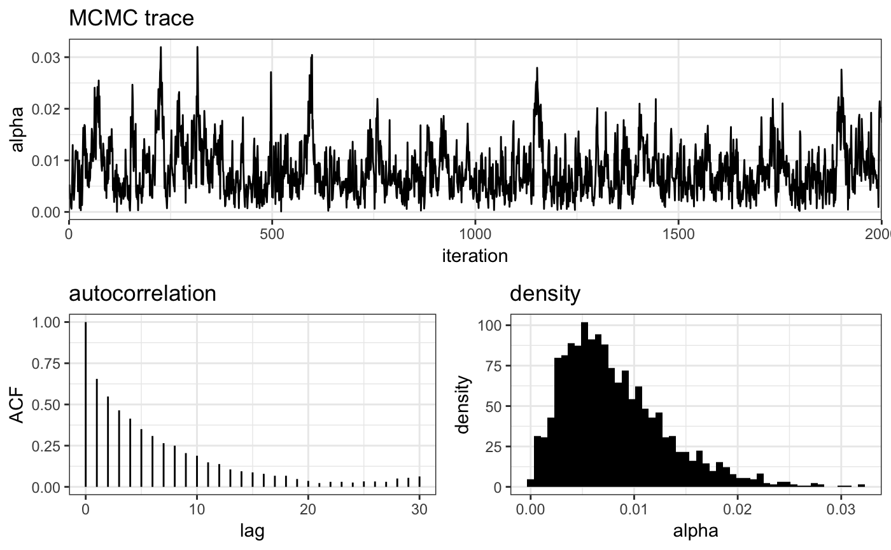

We can visualise the evidence for each value of K in log space, and in terms of the full posterior distribution:

``` r
plot_logevidence_K(myproj)
```

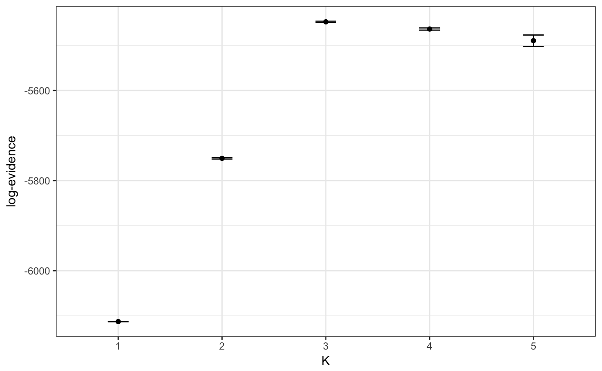

``` r
plot_posterior_K(myproj)
```

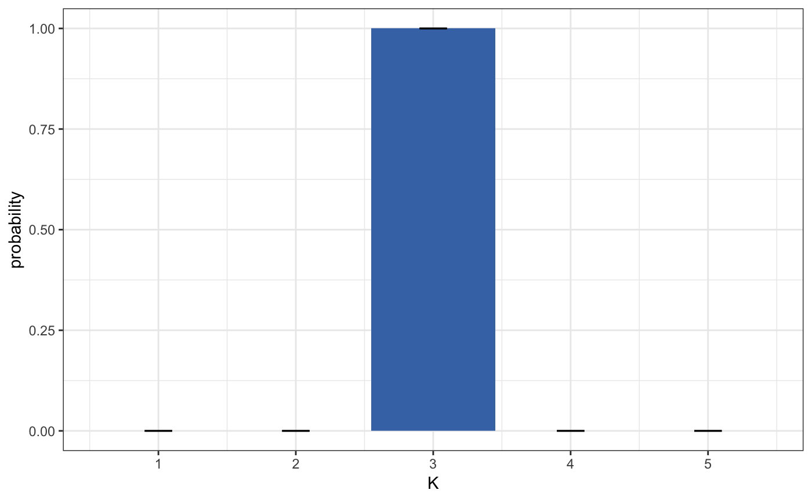

Again, there is clear evidence for K=3 under this model, despite the fact that this model is technically incorrect for the simulated data.

Producing posterior allocation plots for a range of values of K we see results similar to the no-admixture model, with most individuals assigned to just a single subpopulation.

``` r
plot_qmatrix(myproj, K = 2:5, divide_ind_on = TRUE)
```

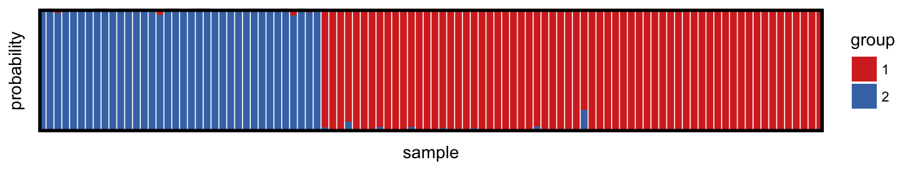

### Comparing evolutionary models

Finally, we can make use of one of the major advantages of the model evidence - the ability to compare between different evolutionary models. The overall evidence of a model is taken as the average over all values of K under that model. We can plot the overall model evidence in log space, and in the form of a posterior distribution after transforming to linear space and normalising to sum to one:

``` r
plot_logevidence_model(myproj)
```

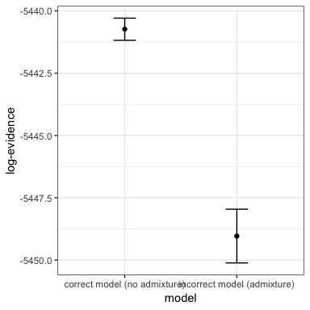

``` r
plot_posterior_model(myproj)
```

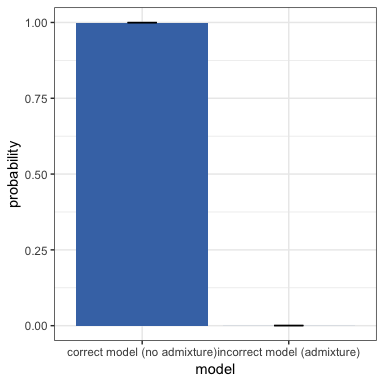

It is clear that there is far greater support for the no-admixture model, therefore we would be justified in ignoring the output from the admixture model and only reporting results of the no-admixture model.
